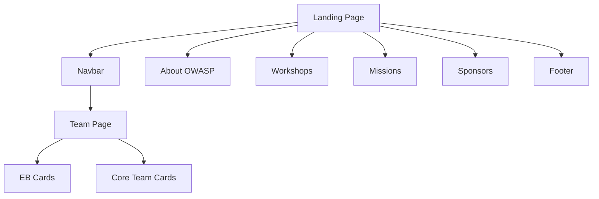
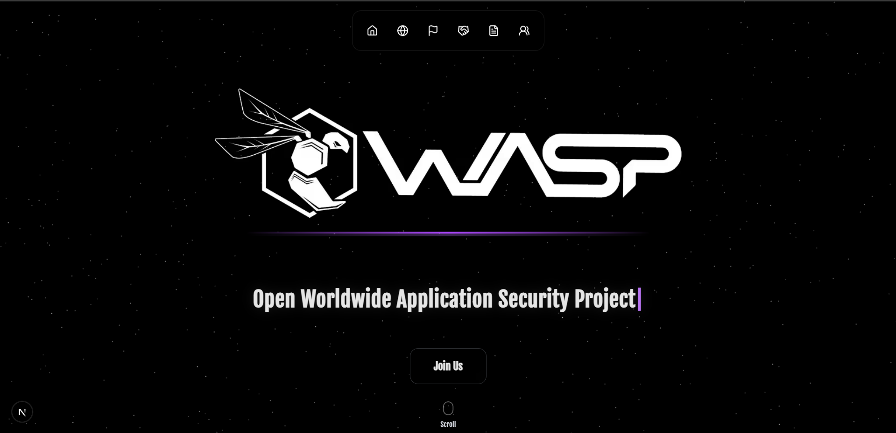
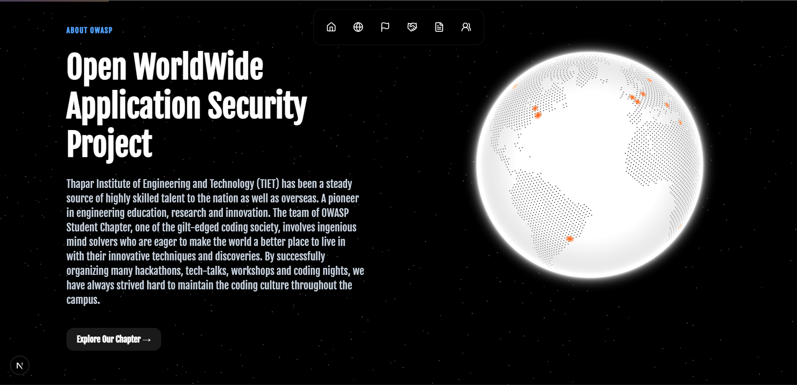
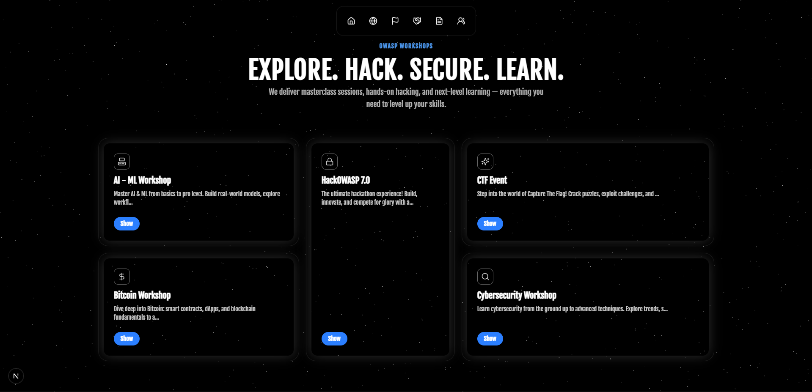
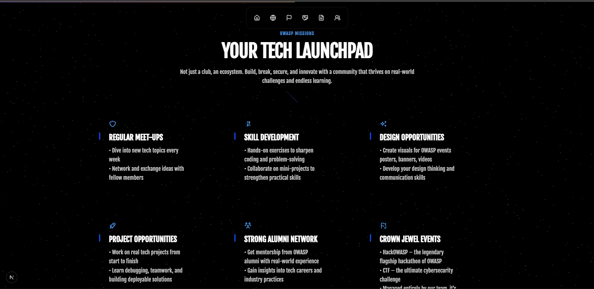
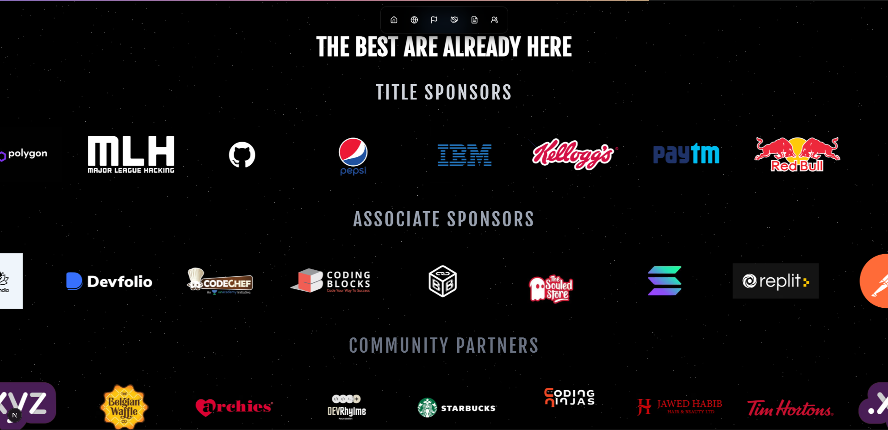
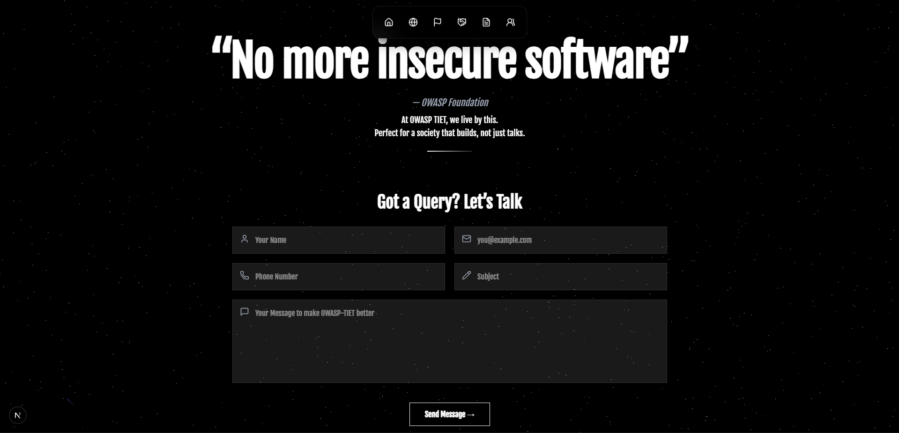
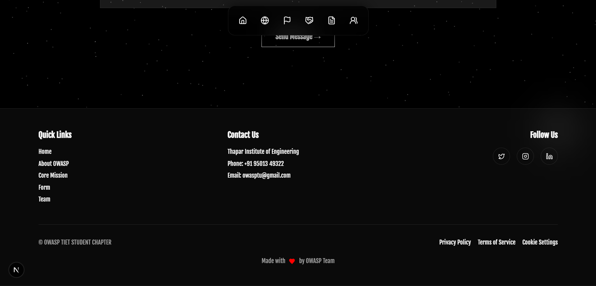
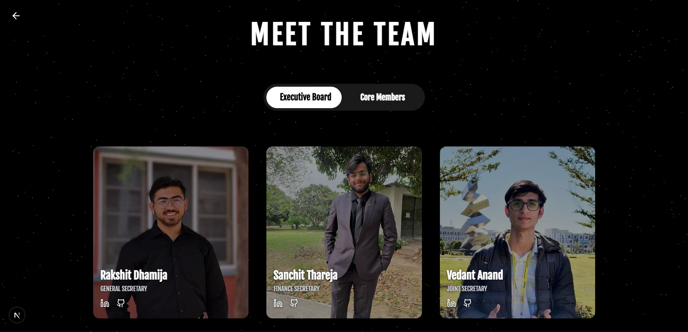
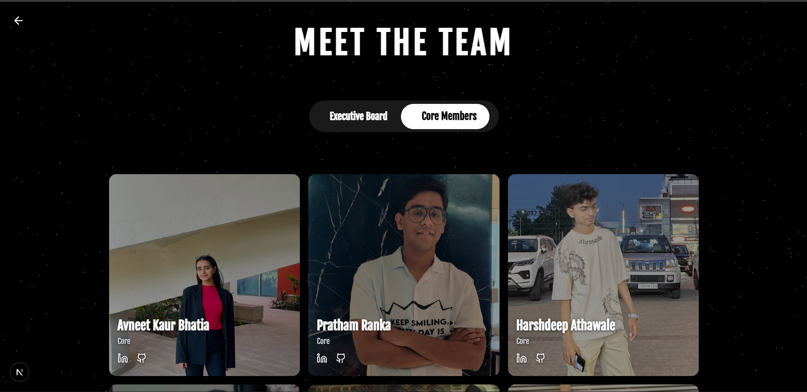

## 🌐 Official OWASP TIET Website
This is the official website for OWASP TIET, built with Next.js, Tailwind, and Framer Motion. It showcases the core team, events, sponsors, and OWASP features in a modern, animated UI.


## 📂 Folder Structure

```plaintext
src/
├── app/
│   ├── team/
│   │   ├── layout.tsx
│   │   ├── page.tsx
│   │   ├── team.css
│   ├── globals.css
│   ├── layout.tsx
│   ├── page.tsx
│
├── components/
|   └──pages/
│   ├── Footer/
│   │   └── footer.tsx
│   ├── Globe&Bento/
│   │   └── scroll-section.tsx
│   ├── LandingPage/
│   │   └── element.tsx
│   ├── Navbar/
|   |   └──dock.tsx
│   ├── OwaspFeatures/
│   │   └── feature-section.tsx
│   ├── Sponsors/
│   │   ├── company-carousel.tsx
│   │   └── Sponsors.tsx
│   ├── TeamCards/
│   │   ├── core-team-card.tsx
│   │   └── eb-team-card.tsx
│
│   ├── ui/
│   │   ├── background-ui/
│   │   │   ├── shooting-stars.tsx
│   │   │   └── stars-background.tsx
│   │   ├── cursor-ui/
│   │   │   ├── cursor-1.tsx
│   │   │   └── cursor-2.tsx
│   │   ├── dock-ui/
│   │   │   ├── dock.tsx
│   │   │   └── dock-two.tsx
│   │   ├── features-owasp-ui/
│   │   |     ├── function-section-with-hover-effect.tsx
│   │   ├── footer-ui/
│   │   │   ├── footer-button.tsx
│   │   │   ├── footer-checkbox.tsx
│   │   │   ├── footer-input.tsx
│   │   │   ├── footer-label.tsx
│   │   │   ├── footer-section.tsx
│   │   │   ├── footer-switch.tsx
│   │   │   ├── footer-textarea.tsx
│   │   │   ├── footer-tooltip.tsx
│   │   │   └── forms.tsx
│   │   ├── Globe-Bento-ui/
│   │   │   ├── badge.tsx
│   │   │   ├── bento-grid.tsx
│   │   │   ├── globeb.tsx
│   │   │   ├── glowing-effect.tsx
│   │   │   └── hero-scroll-animation.tsx
│   │   ├── ScrollProgress-ui/
│   │   │   └── scroll-progress.tsx
│   │   ├── Sponsors-ui/
│   │   │   └── InfiniteCarousel.tsx
│   │   ├── TeamCards-ui/
│   │   │   └── focus-card.tsx
│   │   ├── AnimatedPageWrapper.tsx
│   │   └── ScrapedBodyStyle.tsx
```

## 🛠 Tech Stack

-  **Next.js**
-  **TypeScript**
-  **Tailwind CSS**
-  **Framer Motion**
-  **ShadCN**


## ✨ Features
- Modern and responsive UI
- Team showcase with hover effects
- Sponsors carousel
- Interactive landing page with animations
- Optimized performance

## 🔍 Website Architecture



## 🛠 Installation

Clone the repository:
```bash
git clone https://github.com/yourusername/Main_Website.git
cd Main_Website
```
Install dependencies:
```npm install```

Run the development server:
``` npm run dev ```

Open your browser and visit:
``` http://localhost:3000 ```


## 🤝 Contributing
We welcome contributions! Follow these steps:

1. Fork the repository
2. Clone your fork:
```bash 
git clone https://github.com/your-username/Main_Website.git
```
3. Create a new branch:
``` bash
git checkout -b feature-name
```
4. Make changes and commit:
``` bash 
git commit -m "Add new feature"
```
5. Push to your fork:
``` bash 
git push origin feature-name
```


## 📸 Screenshots

| Landing Page | About OWASP | Workshop |
|--------------|-------------|----------|
|  |  |  |

| Missions | Sponsors | Form |
|----------|----------|------|
|  |  |  |

| Footer | EB Cards | Core Cards |
|--------|----------|------------|
|  |  |  |


## 📜 License


